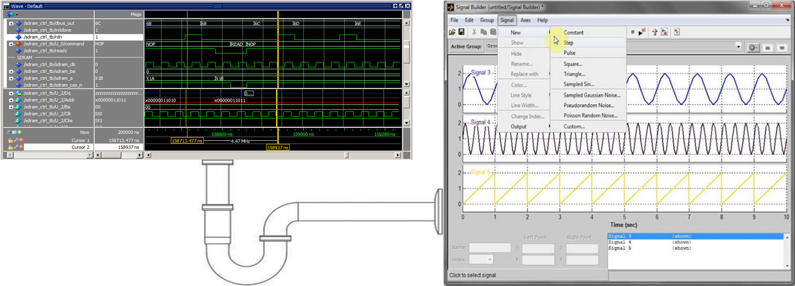
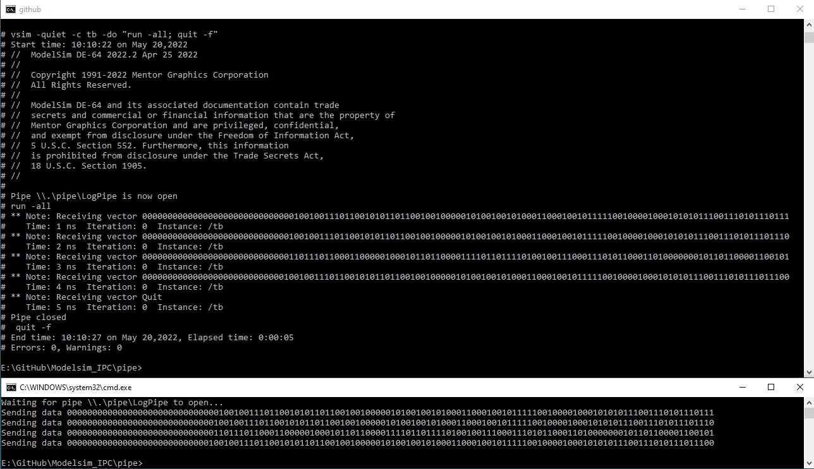
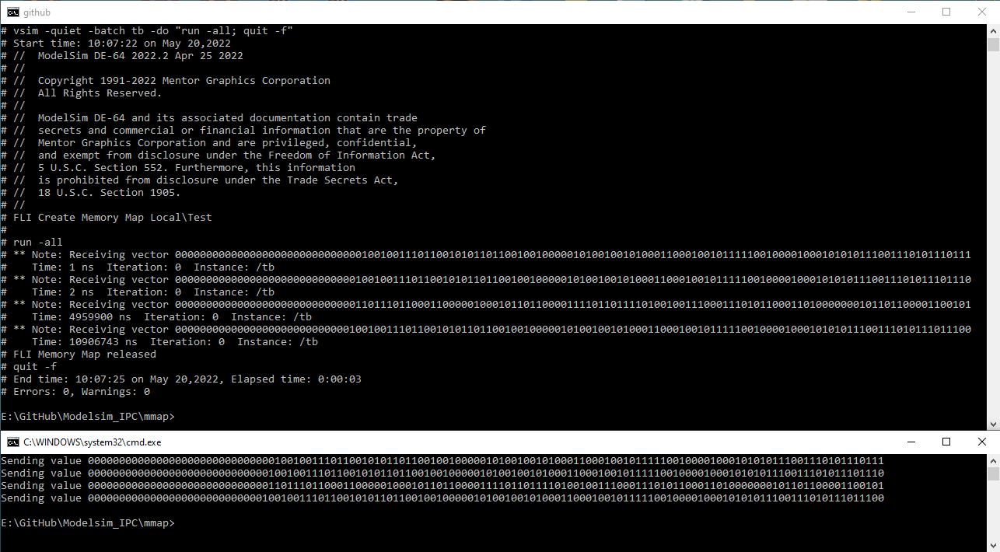

# Modelsim Inter-Process Communication (IPC)

 

For most designs data used in a testbench is either generated by the testbench itself or pre-generated by some external program like Python, Matlab, exe, etc. and then fed into the testbench via a text file. There are however occasions where it is beneficial if test vectors combined with some control info can be streamed into a life simulation, this where [Inter Process Communication](https://en.wikipedia.org/wiki/Inter-process_communication) comes in. **IPC** is simply a data stream between 2 or more processes. There any several ways IPC can be implemented, examples are:

+ Sockets
+ [Named Pipes](https://en.wikipedia.org/wiki/Named_pipe)
+ Shared Memory ([mmap](https://en.wikipedia.org/wiki/Mmap))
+ Virtual peripheral, for example back to back UART

Of this list sockets are the most flexible and most used IPC method, a socket examples with Modelsim can be found [here](https://github.com/htminuslab/Modelsim-Socket-Fern). Virtual peripherals are not that often used as it needs a third party process to connects the two virtual peripherals together, a good example is **com0com** for which an example can be found [here](https://github.com/htminuslab/Modelsim_FLI_UART).

This repository contains 2 simple FLI based examples of IPC using **named pipes** and **shared memory**. The examples are kept simples to show the simplicity of using these method but for any real usage an extra "layer" will be required to handle flow control and more complex data structures.

## FLI
The **Foreign Language Interface** (FLI) is a VHDL C/C++ API used on Siemens' Modelsim and Questa simulator products. The FLI allows a C/C++ program to simulate together with VHDL (or Verilog via a wrapper), enabled a C/C++ program to traverse the hierarchy of a mixed VHDL/Verilog design, get information about and set values of VHDL/Verilog objects, get information about and control a simulation, add commands etc. The FLI is the oldest and most mature C/C++ API on Modelsim/Questa and was added during the early development years of Modelsim.
 
The FLI supports 2 modes of operations, the simpler **foreign subprogram** in which a VHDL procedure or function is implemented in C/C++ and a **foreign architecture** which implements a VHDL architecture in C/C++. A demo of the latter can be found [here](https://github.com/htminuslab/Modelsim-Unicorn). This demo will use the simpler foreign subprogram in which some VHDL functions and procedures are implemented in C and interfaced to Modelsim via the FLI.

 
## Requirements
1) 64bits Modelsim DE (or Questa), Modelsim PE users need to install 64bits Modelsim DE *(works on a PE license)*
2) Visual Studio 2019 (free community edition), the Modelsim supplied gcc compiler will also work but not shown.
3) Python 3.8
4) Python [pywin32](https://pypi.org/project/pywin32/) is required for the pipe demo

## Check before building
1) Make sure the Modelsim installation root directory is set via the **MTI_HOME** environmental variable. This is required because the **run.bat** files uses %MTI_HOME%/include and %MTI_HOME%/win64pe.
```
E:\Modelsim_IPC>echo %MTI_HOME%
D:\Products\modelsim_de_2022
```

2) The 64bits Visual Studio compiler is added to the search PATH.

```
call "C:\Program Files (x86)\Microsoft Visual Studio\2019\Community\VC\Auxiliary\Build\vcvarsall.bat" x86_amd64

E:\Modelsim_IPC>cl /?
Microsoft (R) C/C++ Optimizing Compiler Version 19.29.30137 for x64
Copyright (C) Microsoft Corporation.  All rights reserved.
```

3) pywin32 is required for the named pipe example only

```
pip install pywin32

E:\Modelsim_IPC>pip show pywin32
Name: pywin32
Version: 300
Summary: Python for Window Extensions
Home-page: https://github.com/mhammond/pywin32
```
 
## How do the demos work? 

For both demos four 128bits vectors are send from a python application via a named pipe or shared memory to Modelsim. To simulate some delay in sending the data, each 128bits vector is send one second apart. After the 4 vectors are send a termination character is send which stops the Modelsim simulation.

## Build DLL and run the demo

Navigate to either the pipe or mmap directory and execute **run.bat** in a **CMD** prompt. The batch file will build the DLL and invoke a separate CMD prompt for the Python program before running Modelsim in command line mode. 

### Modelsim pipe results

 
### Modelsim mmap results
 
 
## License

See the LICENSE file for details.

 
## Notice
All logos, trademarks and graphics used herein are the property of their respective owners.